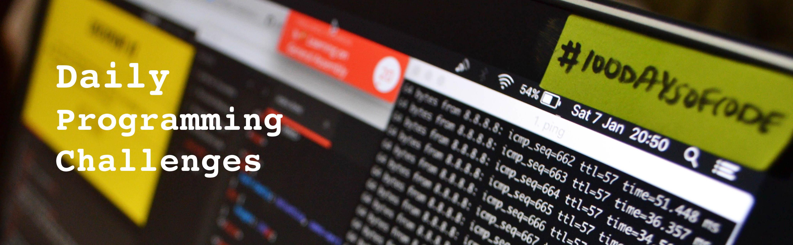

# Daily Programming Challenges 

:running: :hourglass: List of daily challenges for developers

## Front-End :computer:

 - [JavaScript30](https://javascript30.com/)
 - [100dayscss](https://100dayscss.com/)
 - [Daily UI](http://www.dailyui.co/)
 - [Just Build Websites](https://github.com/melanierichards/just-build-websites)
 - [CSS Grid](https://cssgrid.io/)
 - [30 Days of React Native](https://github.com/fangwei716/30-days-of-react-native)
 - [Frontend Mentor](https://www.frontendmentor.io/challenges)
 - [30 Days of Postman](https://blog.postman.com/introducing-30-days-of-postman-coding-challenge/)
 - [Codepen challenges](https://codepen.io/challenges)
 - [CSSBattle](https://cssbattle.dev/)
 
## Solving Problems :dart:
 
 - [URI Online Judge](https://www.urionlinejudge.com.br/)
 - [Hackerrank](https://www.hackerrank.com/)
 - [CodeWars](https://www.codewars.com)
 - [Edabit](https://edabit.com/challenges)
 - [devChallenges](https://devchallenges.io/)

### How to Share
- [Share on Twitter](http://twitter.com/home?status=https://github.com/AlexsandroSA/daily-programming-challenges)
- [Share on Facebook](http://www.facebook.com/sharer/sharer.php?s=100&p[url]=https://github.com/AlexsandroSA/daily-programming-challenges&p[images][0]=&p[title]=Daily%20Programming%20Challenges&p[summary]=)
- [Share on Google Plus](https://plus.google.com/share?url=https://github.com/AlexsandroSA/daily-programming-challenges)
- [Share on LinkedIn](http://www.linkedin.com/shareArticle?mini=true&url=https://github.com/AlexsandroSA/daily-programming-challenges&title=Free%20Programming%20Books&summary=&source=)

### Credits

* __Alexsandro Silva Alves__ - _Initial work_ - [AlexsandroSA](https://github.com/AlexsandroSA)

See also the list of [contributors](https://github.com/AlexsandroSA/daily-programming-challenges/graphs/contributors) who participated in this project.

### License

[MIT](https://github.com/AlexsandroSA/daily-programming-challenges/blob/master/LICENSE) © [Alexsandro Silva Alves](https://twitter.com/alexsandro_sa)
